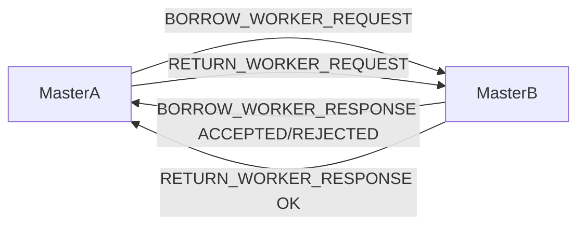

# Fluxo de Negociacao Master-Master

## Objetivo

Permitir que um `Master` saturado empreste Workers de um `Master` vizinho por tempo limitado (`lease`).

## Estado minimo por Master

- `pending_requests`
- `available_workers`
- `borrowed_workers`
- `lent_workers`
- `leases` ativas

## Algoritmo de decisao

1. Master monitora `pending_requests`.
2. Se `pending_requests > saturation_threshold`, inicia tentativa de emprestimo.
3. Consulta peers em ordem (ou por politica de prioridade).
4. Envia `BORROW_WORKER_REQUEST`.
5. Se receber `ACCEPTED`, registra `LEASE_ID` e incrementa `borrowed_workers`.
6. Se todos responderem `REJECTED`/timeout, mantem degradacao local.
7. Ao normalizar carga, envia `RETURN_WORKER_REQUEST` para cada lease.

## Fluxo de mensagens

## Regras de robustez

- Timeout de chamada Master-Master: 5s.
- Retry para operacoes criticas: ate 3 tentativas.
- `REQUEST_ID` obrigatorio para correlacao.
- `LEASE_ID` obrigatorio para devolucao.
